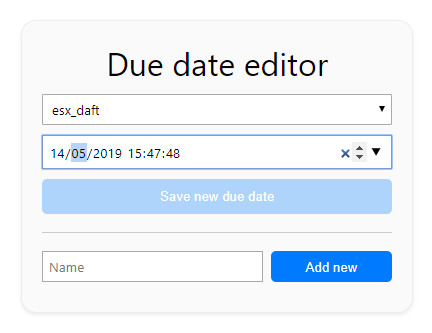

# check_duedate
Nagios plugin that alllows monitoring the remaining time until a certain date. Ideal to remember domain renewals, license expirations, payments, etc. Can be configured to output warning and critical state whenever certain thresholds are crossed.

# Installation
- Copy check_duedate to your Nagios libexec/plugins folder (typically `/usr/local/nagios/libexec`), and set its executable bit (`chown +x check_duedate`). 
- Copy duedate.php to a folder that can be accessed through a web browser. For instance, if you use Nagios XI you can copy it to `/usr/local/nagiosxi/html/tools/`.
- Create the file `/store/check_duedate_data` (the internal data will be stored here) and change the file permissions so that it can be read and written by apache (`chown apache:apache ...`)
- Access the web interface, and configure new expiration dates as needed:



- Configure a new command into Nagios 
```
define command {
    command_name    check_duedate
    command_line    $USER1$/check_duedate --id $ARG1$ $ARG2$
}
```

- Set up a new service that uses the defined command, for instance

```
define service {
    host_name                Expirations
    service_description      Web hosting expiration
    check_command            check_duedate!esx_daft!--unit D --warning 2 --critical 1!!!!!!
    max_check_attempts       1
    check_interval           5
    retry_interval           5
    active_checks_enabled    1
    check_period             xi_timeperiod_24x7
    notification_interval    0
    notification_period      xi_timeperiod_24x7
    contacts                 nagiosadmin
    register                 1
}
```

# check_duedate arguments
`check_duedate --id <DUEID> [--warning <WARNING_THRESHOLD>] [--critical <CRITICAL_THRESHOLD>] [--unit <UNIT>]`

The id must match the name of the expiration that was configured using the web interface.

The default thresholds are 2 days (warning) and 1 day (critical)

Valid values for unit are H (hours), M (minutes), D (days)

The perfdata is also output using the same units, so it should be kept constant to avoid discontinuities.

# Credits
If you have any questions or you found a bug, please open an issue!
By Gonzalo Ávila Alterach (gzalo.com), 2019. Project license: MIT License